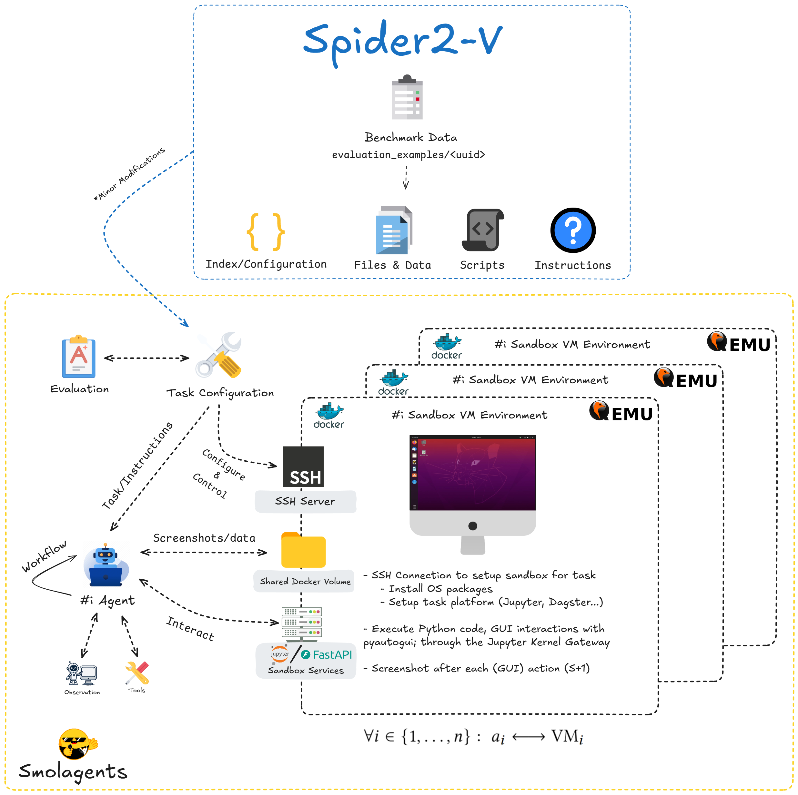
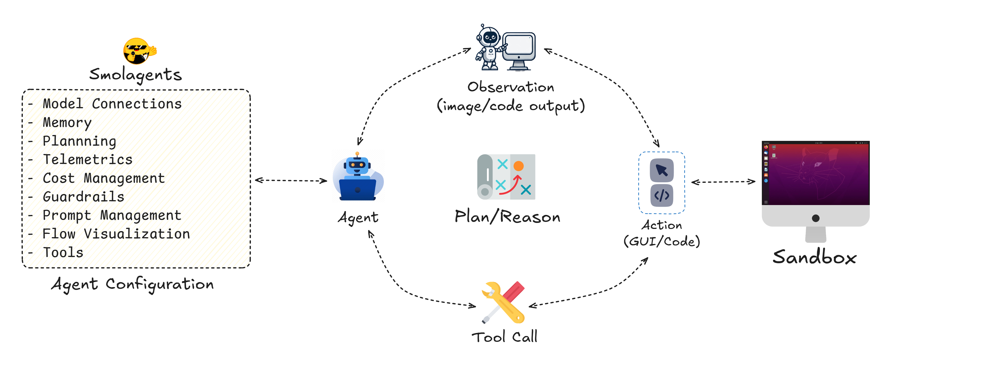

# Enhancing Multimodal GUI AI-Agent Benchmarking

[](https://github.com/melchiorhering/Automating-DS-DE-Workflows/blob/main/LICENSE) [](https://www.python.org/) [](https://www.docker.com/) [](https://fastapi.tiangolo.com/) [](https://jupyter.org/) [](https://huggingface.co/datasets/melchiorhering/vms)

This repository contains the source code and experimental setup for **"Enhancing Multimodal GUI AI-Agent Benchmarking,"** a modular, code-centric framework designed to improve upon the foundation of the [Spider2-V benchmark](https://spider2-v.github.io/).

While powerful benchmarks like Spider2-V provide realistic tasks for evaluating AI agents, their often monolithic designs can hinder research due to poor developer experience (Dev-X), limited observability, and a lack of reproducibility. This framework, built upon the lightweight and code-centric **[Smolagents](https://github.com/huggingface/smolagents)** library, addresses these challenges directly.

## 🖼️ Architectural Overview

The proposed architecture decouples the agent's logic from the task environment. It uses a stack of modern, open-source tools to create isolated, observable, and reproducible sandboxes for the agent to operate in. This design focuses on modularity and standard interfaces, allowing components to be swapped and extended with minimal friction.



## 🔄 Agent Workflow

At the core of the framework is a dynamic, iterative workflow loop that enables the agent to reason, act, and learn from feedback. This `Observe -> Plan -> Act` cycle is central to its problem-solving strategy:

-   **1. Observation:** The agent begins by assessing its environment through a multi-modal observation. This includes both a **screenshot** of the GUI and the **textual output** (or error trace) from the last executed code.

-   **2. Reasoning and Planning:** Based on this combined visual and textual data, the agent analyzes its progress, diagnoses any errors, and formulates a step-by-step plan to move closer to the final goal.

-   **3. Action and Tool Usage:** The plan culminates in a concrete **action**. The agent decides whether to use direct Python code for efficiency or `pyautogui` for necessary GUI interaction. It then generates the code for the chosen tool.

-   **4. Execution:** The action is executed in the sandboxed environment, which produces a new observation and restarts the loop.

This iterative process allows the agent to tackle complex, multi-step tasks and provides a mechanism for autonomous error recovery.




## ✨ Key Features

This framework introduces several key improvements over the baseline implementation:

-   **Powered by Smolagents:** Built on the simple, code-first Smolagents framework, enabling transparent agent logic and easy integration with the broader open-source AI ecosystem (e.g., Hugging Face).
-   **Modular & Decoupled Architecture:** Built on **Docker**, **QEMU**, and **SSH**, the framework isolates the agent, its tools, and the sandbox environment. Components are hot-swappable, allowing for rapid iteration.
-   **Flexible Action Space:** The agent isn't locked into rigid primitives. It can dynamically choose between **direct Python code execution** (via a Jupyter Kernel Gateway) for efficiency and **GUI automation** (`pyautogui`) for UI-specific tasks.
-   **Rich Observability:** Gone are the days of manual debugging in VM snapshots. This framework provides:
    -   **Live GUI Access:** Monitor the agent in real-time through any web browser using **noVNC**.
    -   **Structured Logging:** Detailed, step-by-step logs of every action, observation, and thought process.
    -   **Telemetry:** Compatibility with **OpenTelemetry** for exporting detailed performance metrics.
-   **Improved Developer Experience (Dev-X):** By leveraging open standards and reducing the core Python codebase by **66%**, the framework is significantly easier to understand, maintain, and extend.

## 🚀 Getting Started

Follow these steps to set up the environment and run the benchmark.

### 🛠️ Prerequisites

Ensure you have the following dependencies installed on your system:

-   **[Python (3.12+)](https://www.python.org/downloads/)**: The core programming language.
-   **[UV](https://github.com/astral-sh/uv)**: A fast Python package installer and resolver, used here to manage dependencies.
-   **[Direnv](https://direnv.net/)**: A tool to manage project-specific environment variables automatically.
-   **[Docker](https://www.docker.com/products/docker-desktop/)**: To build and manage the containerized sandbox environments.

### ⚙️ Installation

1.  **Clone the repository:**
    ```bash
    git clone https://github.com/melchiorhering/Automating-DS-DE-Workflows.git
    cd Automating-DS-DE-Workflows
    ```

2.  **Prepare the Sandbox OS Image:**
    This framework requires a configured QEMU virtual machine image to serve as the agent's sandbox. You have two options to set this up:

    -   **Option A (Recommended):** Download a pre-configured image directly from the [Hugging Face Hub](https://huggingface.co/datasets/melchiorhering/vms). Place the downloaded `ubuntu-base` directory inside the `src/docker/vms/` folder.
        -   Use Git submodules to sync the OS image files in the this repository
        -   Use the python script in `src/docker` to download the files.

    -   **Option B (Advanced):** Build the OS image from scratch. The necessary scripts are provided for Linux-based systems in the `src/docker/` directory. Please follow the instructions in the `README.md` file within that directory.

3.  **Allow Direnv to manage the environment:**
    ```bash
    direnv allow
    ```
    This will automatically create a virtual environment for you based on the `.envrc.example` file.

4.  **Install Python dependencies with UV:**
    ```bash
    uv sync --all-extras
    ```
    This command reads the `pyproject.toml` file and syncs the project environment for you.


5.  **Setup Pre-Commit**
    ```bash
    uv run pre-commit install
    ```
    This will setup pre-commit, pre-commit will make sure that the code stays a bit clean..


## 📈 Usage

### Running the Benchmark Orchestrator

The main entry point for running experiments is the orchestrator script. You can run all tasks sequentially or a specific subset.

```bash
cd src

# Example: Run all tasks defined in the jupyter test index sequentially
uv run cli.py \
    --task-index /path/to/your/task_list.json \
    --tasks-root /path/to/your/task_definitions/ \
    --results-root results/
```

Results, logs, and other artifacts for each task run will be saved to the `results/` directory.

### Analyzing Results

The repository includes Python scripts and notebooks to process the generated `summary.json` files, calculate aggregate metrics, and create plots to visualize the results.

## 📄 License

This project is licensed under the MIT License. See the [LICENSE](https://opensource.org/license/mit) file for details.
